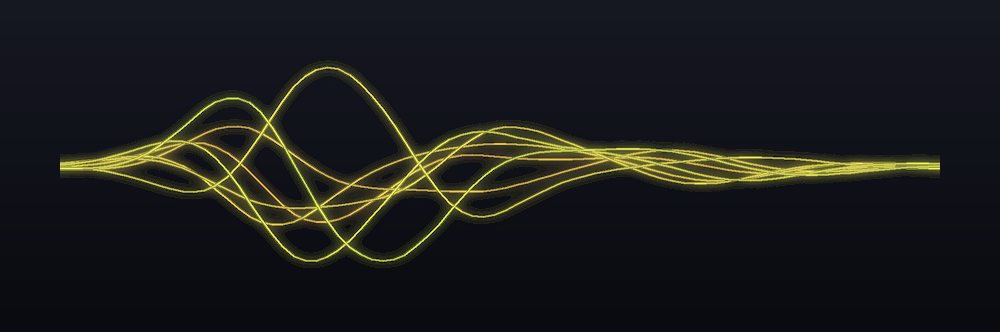
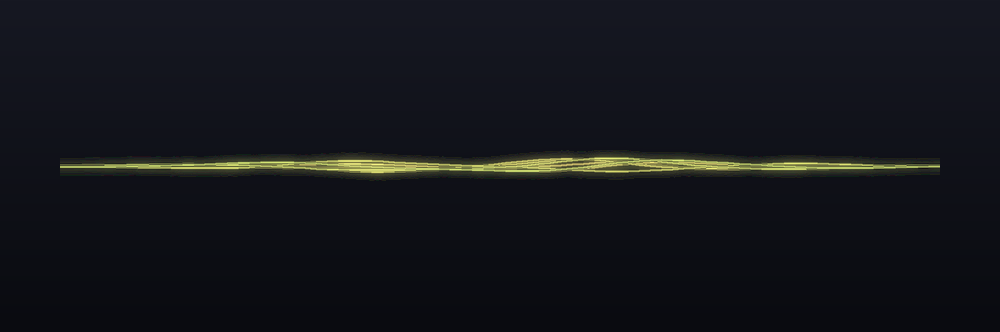

# Aurora Voice 🌊

**Fully-local AI voice dictation for Windows.** Hold a hotkey, speak, release — clean,
punctuated text appears at your cursor in whatever app you're using, about a second later.
Your voice never leaves your machine.

A free, open-source, privacy-first alternative to cloud dictation tools like Wispr Flow —
with a live **Aurora Silk** overlay: a glowing frequency-chart ribbon that floats on your
desktop and dances with your voice while you speak.

> Not affiliated with or endorsed by Wispr AI.

<p align="center">
  
  <br>
  <em>The Aurora Silk overlay — a per-pixel-alpha glow ribbon whose shape, height, and colour <b>are</b> your voice.</em>
</p>

## How it works

```
hold F9 → mic capture → Silero VAD → faster-whisper large-v3 (CUDA)
        → Ollama LLM cleanup (fillers, punctuation, grammar, tone)
        → clipboard-safe paste into the focused app
```

- **~1 second** end-to-end for a 10-second utterance (measured: ASR ~0.6 s + LLM ~0.25 s
  on an RTX 5080)
- **100% offline** after model download — works with Wi-Fi disabled
- **AI cleanup with guardrails**: the LLM fixes punctuation and removes filler words but
  is length-guarded so it can never answer your questions or obey instructions in your
  speech; if Ollama is down, your raw transcript still pastes — words are never lost

## Features

| | |
|---|---|
| 🎯 **Dictate anywhere** | Any app that accepts a paste: editors, browsers, terminals, chat, Electron apps |
| 🧠 **AI cleanup** | Local LLM removes "um/uh", fixes punctuation/grammar, preserves your wording |
| 🌊 **Aurora Silk overlay** | Per-pixel-alpha glow ribbon = live mel spectrum of your voice; amber vowels ↔ cyan sibilants, whispers go pale, consonants flare |
| 📚 **Custom vocabulary** | Your names/jargon bias both Whisper and the cleanup LLM |
| 🗣 **Voice commands** | "new paragraph", "new line", "delete that" (undo), "press enter/tab" |
| 🪟 **Context profiles** | Detects the target app: code editors/terminals get raw text (identifiers safe), email gets professional tone, chat stays casual |
| ⌨️ **PTT modes** | Hold-to-talk or tap-to-toggle |
| 🖥 **Tray + autostart** | Status icon (idle/rec/busy), single-instance, headless logging |

## The Aurora Silk overlay

The overlay floats on your desktop while you dictate — no window, no box, just a
glowing strand ribbon drawn from a live mel spectrum of your voice at ~60 fps. Its
**shape** follows your frequencies and its **colour** follows your voice: warm amber
for open vowels and low tones, cool cyan for sibilants and highs, paling on whispers
and flaring on hard consonants.

|  |  |
|:--:|:--:|
| <br>**Listening — at rest**<br><sub>calm amber, breathing gently while it waits for your voice</sub> | <br>**Vowel**<br><sub>warm amber, energy pooled in the low bands (left)</sub> |
| <br>**Sibilant**<br><sub>shifts cyan as high-frequency energy (right) takes over</sub> | <br>**Loud speech**<br><sub>the whole ribbon lights up and flares on consonant onsets</sub> |

<sub>Rendered headlessly from `app/overlay.py` — the same code that draws the live overlay. See `docs/VISUAL-RESEARCH.md` for the design research behind it.</sub>

## Requirements

- Windows 11 (Windows 10 likely works, untested)
- Python 3.11+
- An NVIDIA GPU (~2.5 GB free VRAM for the default int8 large-v3; smaller Whisper models
  run on far less, or on CPU)
- [Ollama](https://ollama.com) with any small chat model: `ollama pull llama3.2`
- A microphone

Tested on: RTX 5080 (Blackwell) / Ryzen 9 9900X3D / Windows 11 Pro.

## Setup

```powershell
git clone https://github.com/silverspyder1999-tech/aurora-voice
cd aurora-voice
py -3.11 -m venv venv
.\venv\Scripts\python.exe -m pip install -r requirements.txt
copy config.example.toml config.toml     # then edit to taste
.\venv\Scripts\python.exe selftest.py    # verifies GPU/ASR/clipboard/mic
.\venv\Scripts\python.exe -m app.main
```

First run downloads the Whisper model (~3 GB) from HuggingFace. Wait for
`ready - hold 'f9' and speak`, click into any app, **hold F9, speak, release**.

### Autostart at login (optional)

Create a shortcut in `shell:startup` pointing at
`<repo>\venv\Scripts\pythonw.exe` with arguments `-m app.main` and the repo as the working
directory. Headless mode logs to `aurora.log`; a named mutex prevents double instances.

## Configuration — `config.toml`

Everything is in `config.example.toml` with comments: hotkey + PTT mode, Whisper model and
compute type, language, personal vocabulary, voice commands, Ollama model / keep-alive /
timeout, overlay opacity/fps, per-app context profiles (add your own:
`[profiles.myapp] match = ["Some.exe"] style = "..."` or `cleanup = false`).

## Hard-won Windows / RTX 50-series (Blackwell) notes

These cost real debugging time — they're why this repo exists in working form:

1. **CUDA DLLs**: CTranslate2 ≥4.5 needs the `nvidia-cublas-cu12`/`nvidia-cudnn-cu12` pip
   wheels **plus** a PATH-prepend and `ctypes` preload (`app/bootstrap.py`) —
   `os.add_dll_directory` alone fails, sometimes as a silent hang.
2. **Ollama on Windows**: call `127.0.0.1`, never `localhost` — the IPv6-first fallback
   costs ~2 s per request (9× slowdown measured).
3. **VRAM budget**: large-v3 float16 (~4.7 GB) + a resident LLM + a heavy desktop can
   exceed VRAM and silently spill to system RAM (ASR 0.6 s → 5 s). The int8 default
   (~2.1 GB) avoids this; `turbo` is fastest but drops punctuation on some audio.
4. **Injection**: clipboard-paste (snapshot → paste → restore) is the most compatible
   method; `SendInput`+`KEYEVENTF_UNICODE` is the fallback. UIPI blocks injection into
   elevated windows. Some DirectInput games ignore synthetic input.
5. **The overlay** is a Win32 `UpdateLayeredWindow` surface (pure ctypes, per-pixel alpha,
   click-through, can never steal focus) rendered by Pillow/numpy at ~55 fps — see
   `app/ulw.py` and `docs/VISUAL-RESEARCH.md` for the design research behind it.

## Tests

`selftest.py` (install verification), `test_overlay.py` (overlay visuals + fps + window
styles), `test_phase2/3/4.py` (cleanup quality + guards, commands + vocab, context
profiles), `test_asr.py` / `test_cleanup.py` (component benchmarks).

## Credits & prior art

Built on the shoulders of: [faster-whisper](https://github.com/SYSTRAN/faster-whisper) /
CTranslate2, [Silero VAD](https://github.com/snakers4/silero-vad),
[Ollama](https://ollama.com), and design/implementation lessons from
[whisper-local](https://github.com/drajb/whisper-local),
[Handy](https://github.com/cjpais/Handy),
[WhisperWriter](https://github.com/savbell/whisper-writer),
[whisper-key-local](https://github.com/PinW/whisper-key-local), and
[freeflow-windows](https://github.com/stha-hardik/freeflow-windows).

## License

[MIT](LICENSE)
